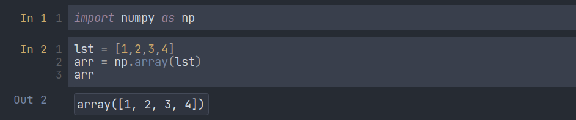

# NumPy - Numerical Python

### Introduction

NumPy (or Numpy) is a Linear Algebra Library for Python, the reason it is so important for Data Science with Python is that almost all of the libraries in the PyData Ecosystem rely on NumPy as one of their main building blocks. Numpy is also incredibly fast, as it has bindings to C libraries.

It is highly recommended you install Python using the Anaconda distribution to make sure all underlying dependencies (such as Linear Algebra libraries) all sync up with the use of a conda install.

## Installation Instructions

It is highly recommended you install Python using the Anaconda distribution to make sure all underlying dependencies (such as Linear Algebra libraries) all sync up with the use of a conda install. If you have Anaconda, install NumPy by going to your terminal or command prompt and typing:

```
conda install numpy
```

If you do not have Anaconda and can not install it, please refer to [Numpy’s official documentation on various installation instructions.](http://docs.scipy.org/doc/numpy-1.10.1/user/install.html)

### How to code using NumPy?

To use NumPy in our program, first, we have to import it. To do this, we have to write the following line:

```python
import numpy as np
```

### Convert a 1D list to a 1D array using NumPy:



### Convert a 2D list to a 2D array:


### numpy.arrange()

`np.arrange()` is like `range()` that we use in loops. We can write this in three ways:

`arange(stop)`: Values are generated within the half-open interval `[0, stop)` (in other words, the interval includes the ***start*** but excludes the ***stop***).


`arange(start, stop)`: Values are generated within the half-open interval `[start, stop)`.


`arange(start, stop, step)` Values are generated within the half-open interval `[start, stop)`, with spacing between values given by `step`.


### Zeros and Ones

`np.zeros()` return a new array of given shape and type, filled with zeros.


`np.ones()` return a new array of given shapes and types, filled with zeros.


### **numpy.linspace()**

`numpy.linspace()` returns evenly spaced numbers over a specific interval. 


### numpy.eye()

It returns a 2-D array with ones on the diagonal and zeros elsewhere.


### Create an array with random numbers

We can use the `random` module to create an array with random numbers.


### Change the shape of an array

We can reshape our array by using `reshape()`. But we have to make sure that the dimension is the same.


### Find the maximum and minimum of an array and their index


### Find the shape and data type of an array

It will return a tuple with the dimensions of the array.


### Array Indexing (1D Array)

NumPy array indexing is similar to list indexing.


There is a problem in slicing the array. To understand it better, let’s see an example:


From the photo above, we can see that, when you edit `c`, it also affects `b`. It is happening because in the 3rd line we are not copying the array. Instead of copying, it only shows the live view of the array `b`. So, to fix this issue what we can do is we can use a method called `.copy()`.


Now, changing `c` is not affecting `b`. 

### Array Indexing (2D Array)

This code will help you to understand 2D array indexing and slicing. Slicing is almost similar to the 1D array. Just you have to think row and column-wise.


We can also filter our data using conditions like these:


### NumPy Operations

We can add two arrays like a normal variable and what will happen is all the elements will be added with the corresponding other array elements. Other operators will act like the same way.


